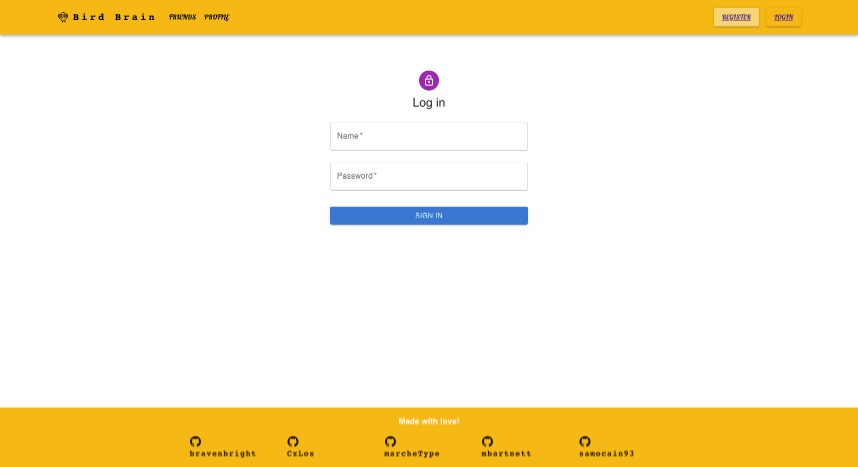
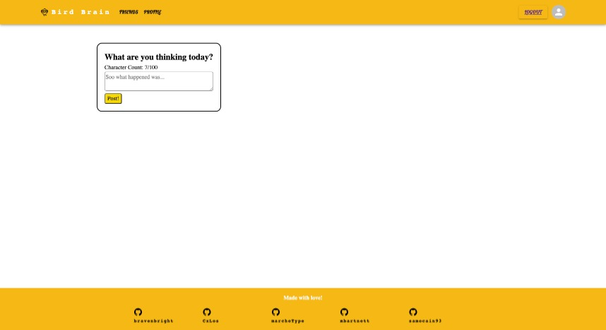

# Bird-Brain

## Description
A social media platform for birders.

## Table of Contents

&bull; [Installation & Testing](#installation--testing) 
&bull; [Usage](#usage) 
&bull; [License](#license) 
&bull; [How to Contribute](#how-to-contribute) 
&bull; [Questions](#questions)

## Installation & Testing
To install the Bird Brain application, start by cloning the repository. Once you have the project on your local machine, navigate to the root directory. From there, install the necessary dependencies using `npm install`. Be sure to create a `.env` file in the root directory and add your own environment variables for the database connection, JWT secret key, and any other necessary variables. To start the application, run `npm start` in the terminal.

## Usage

[Bird Brain](https://birdbrain.herokuapp.com/)

## License

Copyright © 2023. Distributed under the [MIT](https://opensource.org/licenses/MIT) License.

## How to Contribute

If you have a suggestion that would make this application better, please fork the repo and create a pull request.

## Questions

Contact: [github.com/mbartnett](https://github.com/mbartnett), [github.com/samocain93](https://github.com/samocain93), [github.com/cxlos](https://github.com/cxlos), [github.com/bravenbright](https://github.com/bravenbright), [github.com/marchetype](https://github.com/marchetype)    